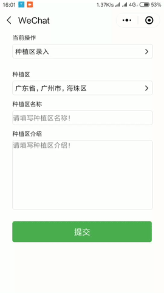

# wxapp-demo
一个信息录入小程序前端部分

项目地址：[wxapp-demo](https://github.com/michwh/wxapp-demo)
# 界面



# 项目结构

```
│  app.js
│  app.json
│  app.wxss
│  project.config.json
│  
├─behaviors
│  ├─optionListBehaviors.js
│  │      
│  └─plantingAreaBehaviors.js
│      
├─components //存放组件
│          
├─image //存放图标
│      
├─pages //存放界面
│  ├─index
│  │      
│  ├─logs
│  │      
│  └─recordInfo //信息录入界面
│          
└─utils

```
